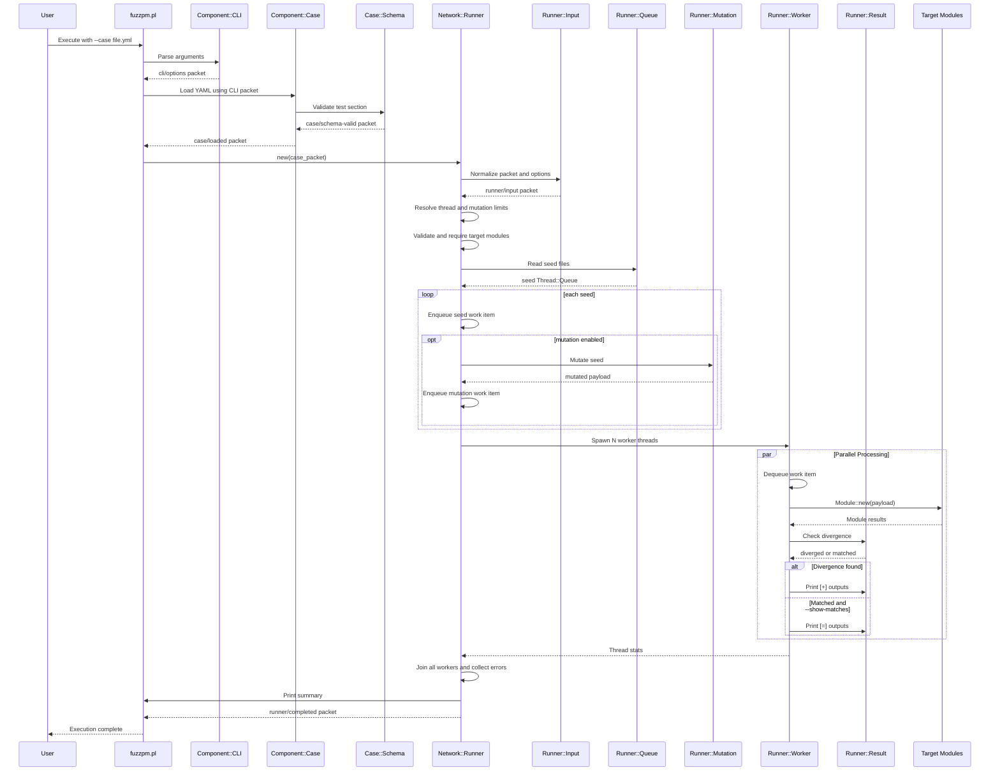

# FuzzPM Architecture Documentation

This document provides a detailed technical overview of FuzzPM's architecture, components, and internal workings.

---

## Table of Contents

- [Overview](#overview)
- [System Architecture](#system-architecture)
- [Core Components](#core-components)
- [Execution Flow](#execution-flow)
- [Threading Model](#threading-model)
- [Module System](#module-system)
- [Dependencies](#dependencies)

---

## Overview

FuzzPM is built as a modular Perl application that implements differential fuzzing through a multi-threaded execution model. The system is designed to be extensible, allowing users to easily add new target modules and test cases.

### Key Design Principles

1. **Modularity**: Core functionality is separated into distinct components
2. **Extensibility**: Easy to add new targets without modifying core code
3. **Performance**: Multi-threaded execution for efficient fuzzing
4. **Simplicity**: YAML-based configuration for ease of use

---

## System Architecture

```
┌─────────────────────────────────────────────────────────┐
│                    fuzzpm.pl                            │
│              (Main Entry Point)                         │
└──────────────────┬──────────────────────────────────────┘
                   │
        ┌──────────┴──────────┐
        │                     │
┌───────▼────────┐   ┌────────▼──────────┐
│  CLI Component │   │  Case Component   │
│  (Options)     │   │  (YAML Parser)    │
└───────┬────────┘   └────────┬──────────┘
        │                     │
        └──────────┬──────────┘
                   │
        ┌──────────▼──────────┐
        │   Network::Runner    │
        │  (Thread Manager)    │
        └──────────┬───────────┘
                   │
        ┌──────────▼───────────┐
        │   Worker Threads      │
        │  (Parallel Execution) │
        └──────────┬────────────┘
                   │
        ┌──────────▼────────────┐
        │   Target Modules      │
        │  (User-defined)      │
        └───────────────────────┘
```

---

## Core Components

### 1. FuzzPM::Component::CLI

**Location**: `lib/FuzzPM/Component/CLI.pm`

**Purpose**: Parses and validates command-line arguments.

**Key Methods**:
- `new()` - Parses command-line options using `Getopt::Long`

**Options Handled**:
- `--case` / `-c`: Path to YAML test case file
- `--threads` / `-t`: Number of threads (integer)
- `--mutate` / `-m`: Enable seed mutation (experimental)
- `--mutate-times`: Number of mutations to run per seed (implies `--mutate`)
- `--show-matches` / `-s`: Print target output even when they agree
- `--help` / `-h`: Display help message

**Returns**: Hash reference with parsed options

---

### 2. FuzzPM::Component::Case

**Location**: `lib/FuzzPM/Component/Case.pm`

**Purpose**: Loads and parses YAML test case files.

**Key Methods**:
- `new($file)` - Reads and parses YAML file, returns test case structure

**Test Case Structure**:
```perl
{
    seeds         => ['seeds/file1.txt', 'seeds/file2.txt'],
    targets       => ['Module1', 'Module2'],
    target_folder => 'targets/category'
}
```

**Dependencies**: `YAML::Tiny` for YAML parsing

---

### 3. FuzzPM::Network::Runner

**Location**: `lib/FuzzPM/Network/Runner.pm`

**Purpose**: Manages the fuzzing execution, thread creation, and result comparison.

**Key Methods**:
- `new($case_packet_or_test_case, @legacy_args)` - Main entry point for fuzzing execution

**Responsibilities**:
1. Normalize packet or legacy runner inputs
2. Validate thread and mutation limits
3. Load target modules dynamically
4. Read seed files and populate the seed queue
5. Expand seeds into executable work items, including optional mutations
6. Create and manage worker threads
7. Aggregate worker statistics

**Supporting Modules**:
- `Runner::Input` - Normalizes packet-mode and legacy inputs
- `Runner::Limit` / `Runner::LimitFromEnv` - Validates configured limits
- `Runner::Target` - Validates and loads target modules
- `Runner::Queue` - Reads seed files into a `Thread::Queue`
- `Runner::Mutation` - Builds mutation payloads when enabled
- `Runner::Worker` - Executes payloads against targets
- `Runner::Result` - Compares and prints module outputs

**Threading**:
- Uses Perl's `threads` module
- `Thread::Queue` for thread-safe work distribution
- `threads::shared` for shared output lock

**Default Configuration**:
- Default thread count: 4
- Maximum thread count: 64, override with `FUZZPM_MAX_THREADS`
- Maximum mutations per seed: 1024, override with `FUZZPM_MAX_MUTATIONS`
- Shared output lock for synchronized printing

---

### 4. FuzzPM::Component::Mutator

**Location**: `lib/FuzzPM/Component/Mutator.pm`

**Purpose**: Provides seed mutation functionality (experimental).

**Key Methods**:
- `new($seed)` - Mutates a seed string using Radamsa

**Algorithm**: Uses the CPAN `Radamsa` binding with a bounded output size

**Status**: Experimental feature used when mutation is enabled (`--mutate` or `--mutate-times`)

---

## Execution Flow

### Program Flow Diagram

The following diagram illustrates the current execution flow of FuzzPM from
startup to completion:

```mermaid
flowchart TD
    Start([fuzzpm.pl starts]) --> CLI[CLI::new<br/>parse argv into cli/options packet]
    CLI --> NeedHelp{help requested<br/>or missing --case?}
    NeedHelp -->|Yes| Help[print help]
    Help --> Exit([exit 0])
    NeedHelp -->|No| Case[Case::new<br/>read YAML from --case]

    Case --> Schema[Case::Schema::new<br/>validate test schema]
    Schema --> CasePacket[case/loaded packet<br/>case + CLI options]
    CasePacket --> Runner[Runner::new]

    Runner --> Input[Runner::Input<br/>normalize packet or legacy args]
    Input --> Limits[LimitFromEnv + Limit<br/>resolve thread and mutation caps]
    Limits --> Target[Runner::Target<br/>validate target folder and require modules]
    Target --> SeedQueue[Runner::Queue<br/>read seed files into Thread::Queue]

    SeedQueue --> WorkQueue[build work queue<br/>enqueue seed items]
    WorkQueue --> Mutate{mutation enabled?}
    Mutate -->|Yes| Mutation[Runner::Mutation<br/>create mutation items via Mutator]
    Mutation --> QueueEnd[end work queue]
    Mutate -->|No| QueueEnd

    QueueEnd --> Spawn[spawn worker threads]
    Spawn --> Worker[Runner::Worker<br/>dequeue work items]
    Worker --> PrintInput[print seed or mutation<br/>with shared output lock]
    PrintInput --> Targets[call each target module<br/>Module::new payload]
    Targets --> Results[Runner::Result<br/>compare defined values and outputs]
    Results --> Diverged{diverged?}
    Diverged -->|Yes| PrintDiv[print diverged target outputs<br/>with shared output lock]
    Diverged -->|No| Matches{--show-matches?}
    Matches -->|Yes| PrintMatch[print matched target outputs<br/>with shared output lock]
    Matches -->|No| MoreWork{more work?}
    PrintDiv --> MoreWork
    PrintMatch --> MoreWork
    MoreWork -->|Yes| Worker
    MoreWork -->|No| Stats[worker returns stats]

    Stats --> Join[Runner joins all workers<br/>collects stats and errors]
    Join --> Summary[print summary<br/>seeds, payloads, module calls, threads, elapsed]
    Summary --> Complete([runner/completed packet or legacy success])

    style Start fill:#e1f5e1
    style Complete fill:#e1f5e1
    style Exit fill:#ffe1e1
    style SeedQueue fill:#fff4e1
    style WorkQueue fill:#fff4e1
    style Worker fill:#e1e5ff
    style Diverged fill:#ffe1e1
```



### Simplified Sequential Flow

For a high-level view of the sequential execution phases:



### Step-by-Step Process

1. **Initialization** (`fuzzpm.pl`)
   - Parse command-line arguments via `CLI::new()`
   - Display help and exit when `--help` is requested or `--case` is missing
   - Pass the CLI packet to `Case::new()`

2. **Case Loading** (`Case::new()`)
   - Read the YAML test case file from the CLI packet
   - Validate the `test` section via `Case::Schema`
   - Return a `case/loaded` packet containing the normalized case and CLI options

3. **Runner Input Normalization** (`Runner::new()`)
   - Accept either a `case/loaded` packet or the legacy argument form
   - Resolve options through `Runner::Input`
   - Apply `FUZZPM_MAX_THREADS` and `FUZZPM_MAX_MUTATIONS` caps

4. **Module Loading** (`Runner::Target::new()`)
   - Iterate through target modules
   - Dynamically `require` each module from `target_folder`
   - Modules must be in format: `./target_folder/ModuleName.pm`
   - `target_folder` and module file paths must resolve inside `targets/`

5. **Seed Queue Population** (`Runner::Queue::new()`)
   - Open each seed file
   - Read lines (one seed per line)
   - Enqueue seed lines into a `Thread::Queue`
   - Mark the seed queue as ended

6. **Work Queue Expansion**
   - Convert each seed into a seed work item
   - When mutation is enabled, add mutation work items using `Runner::Mutation`
   - Mark the work queue as ended before spawning workers

7. **Thread Creation**
   - Create `$num_threads` worker threads
   - Each thread receives: work queue, target modules, and `show_matches`

8. **Worker Execution** (`Runner::Worker::new()`)
   - Dequeue seed or mutation work items from the work queue
   - Print each payload with the shared output lock
   - Execute each target module with the payload
   - Compare module outputs via `Runner::Result`
   - Print divergences, or matched outputs when `--show-matches` is enabled
   - Return per-thread stats

9. **Thread Synchronization**
   - Main thread waits for all workers to complete
   - Worker errors are collected and reported
   - Worker stats are aggregated

10. **Completion**
   - Print a summary with seed count, payload count, module calls, thread count, and elapsed time
   - Return a `runner/completed` packet in packet mode or `1` in legacy mode

---

## Threading Model

### Thread Safety

FuzzPM uses several mechanisms to ensure thread safety:

1. **Thread::Queue**: Thread-safe queue for work distribution
   - Workers dequeue seed and mutation work items atomically
   - No race conditions in payload access

2. **Shared Lock**: `$OUTPUT_LOCK` (shared variable)
   - Synchronizes output printing
   - Prevents interleaved output from multiple threads

3. **Module Isolation**: Each target module is loaded once
   - Modules should be stateless or thread-safe
   - No shared state between module instances

### Thread Lifecycle

```
Main Thread                    Worker Threads
    │                               │
    ├─ Create Seed Queue            │
    ├─ Expand Work Queue            │
    ├─ Create Threads ──────────────┼─ Start
    │                               ├─ Dequeue Work Item
    ├─ Wait (join)                  ├─ Process with Targets
    │                               ├─ Compare Results
    │                               ├─ Print Divergences/Matches
    │                               ├─ Loop until queue empty
    │                               └─ Exit
    └─ Complete
```

---

## Module System

### Target Module Requirements

Target modules must follow a specific interface:

1. **Package Declaration**: Must match filename exactly
   ```perl
   package MyModule {  # File: MyModule.pm
   ```

2. **Constructor**: Must implement `new($payload)` method
   ```perl
   sub new {
       my ($self, $payload) = @_;
       # Process $payload
       return $result;  # or 0 on error
   }
   ```

3. **Error Handling**: Should use `Try::Tiny` for exception handling
   ```perl
   use Try::Tiny;
   
   try {
       # Processing
       return $result;
   }
   catch {
       return 0;  # Signal error
   }
   ```

4. **Return Values**:
   - Success: Return processed result (string/number)
   - Failure: Return `0` or `undef`

### Module Loading

Modules are loaded dynamically at runtime:

```perl
foreach my $module (@target_modules) {
    my $module_path = "./$module_folder/" . $module . '.pm';
    require $module_path;
}
```

**Important**: Module names in YAML must match:
- Filename (without `.pm`)
- Package name (exactly)

---

## Dependencies

### Core Dependencies

| Module | Purpose | Version |
|--------|---------|---------|
| `YAML::Tiny` | YAML parsing | 1.76+ |
| `List::MoreUtils` | List utilities | 0.430+ |
| `Getopt::Long` | CLI parsing | 2.58+ |
| `Readonly` | Immutable variables | latest |
| `Try::Tiny` | Exception handling | latest |

### Threading Dependencies

| Module | Purpose | Status |
|--------|---------|--------|
| `threads` | Thread creation | Core Perl |
| `Thread::Queue` | Thread-safe queues | Core Perl |
| `threads::shared` | Shared variables | Core Perl |

### Test Dependencies

| Module | Purpose | Version |
|--------|---------|---------|
| `Test::More` | Testing framework | Core Perl |
| `File::Temp` | Temporary files | 0.2311+ |
| `FindBin` | Find script directory | 1.54+ |

### Target-Specific Dependencies

Target modules have their own dependencies declared in `targets/*/cpanfile`:

- **URL targets**: `URI`, `WWW::Mechanize`, `Mojo::URL`, `Mojo::UserAgent`
- **JSON targets**: `JSON`, `JSON::Parse`, `JSON::ON`, `Mojo::JSON`
- **Email targets**: `Email::Valid`, `Email::Address`

---

## Data Structures

### Test Case Structure

```perl
{
    seeds         => ['seeds/file1.txt', 'seeds/file2.txt'],
    targets       => ['Module1', 'Module2', 'Module3'],
    target_folder => 'targets/category'
}
```

### Module Result Structure

```perl
{
    module  => 'ModuleName',
    result  => 'output_string',
    defined => 1
}
```

### Queue Structure

- Type: `Thread::Queue`
- Contents: Seed strings (one per line from seed files)
- Access: Thread-safe dequeue operations

---

## Error Handling

### Error Types

1. **File Errors**: Missing seed files or target modules
   - Handled via `croak` from `Carp`
   - Stops execution immediately

2. **Module Errors**: Target module failures
   - Handled within target modules using `Try::Tiny`
   - Common pattern is returning `0` or `undef` to signal error
   - Execution continues with next seed

3. **Thread Errors**: Thread creation or execution failures
   - Perl's thread system handles most errors
   - Main thread waits for all workers

### Error Reporting

- File errors: Printed to STDERR via `croak`
- Module errors: Return values are compared like any other result and may trigger divergence
- Thread errors: Propagated to main thread

---

## Performance Considerations

### Optimization Strategies

1. **Thread Count**: Default 4 threads balances CPU usage and overhead
   - Adjust based on CPU cores: `--threads <count>`
   - Thread count is capped by `FUZZPM_MAX_THREADS` (default: 64)
   - Too many threads: Increased overhead, context switching
   - Too few threads: Underutilized CPU

2. **Queue Size**: Seeds loaded into memory
   - Large seed files: Higher memory usage
   - Consider streaming for very large files (future enhancement)

3. **Module Loading**: Modules loaded once at startup
   - Overhead: Minimal (one-time cost)
   - Benefit: Reused across all seeds

### Bottlenecks

1. **I/O**: Reading seed files (sequential, happens once)
2. **Module Execution**: Depends on target module performance
3. **Output Locking**: Synchronized printing can create contention with many threads

---

## Extension Points

### Adding New Components

1. **New CLI Options**: Extend `FuzzPM::Component::CLI`
2. **New Output Formats**: Modify `FuzzPM::Network::Runner::Result`
3. **New Mutation Strategies**: Extend `FuzzPM::Component::Mutator`
4. **New Target Types**: Create modules following the target interface

### Future Enhancements

- Streaming seed processing for large files
- Configurable output formats (JSON, CSV)
- Additional mutation strategies and deterministic replay support
- Parallel module execution within workers
- Result persistence and analysis tools

---

## Security Considerations

1. **Dynamic Module Loading**: Only loads modules from specified `target_folder`
   - Target modules are loaded with Perl `require` and executed as code
   - Treat YAML files and target folders as trusted inputs

2. **Thread Safety**: Target modules should be stateless or thread-safe
   - Shared state can cause race conditions
   - Each seed processed independently

3. **Input Validation**: Seeds are passed directly to target modules
   - Target modules responsible for input validation
   - Malicious seeds may cause module failures (expected behavior)

---

## Debugging

### Debug Output

Add debug statements in `FuzzPM::Network::Runner::Worker`:

```perl
print STDERR "DEBUG: Processing seed: $line\n";
print STDERR "DEBUG: Module results: " . Dumper(\@module_results) . "\n";
```

### Common Issues

1. **Module not found**: Check filename and package name match
2. **Thread errors**: Verify Perl has threading support
3. **No divergences**: Verify seeds are valid and modules process them
4. **Memory issues**: Reduce thread count or seed file size

---

## References

- [Perl Threads Documentation](https://perldoc.perl.org/threads)
- [Thread::Queue Documentation](https://metacpan.org/pod/Thread::Queue)
- [YAML::Tiny Documentation](https://metacpan.org/pod/YAML::Tiny)
